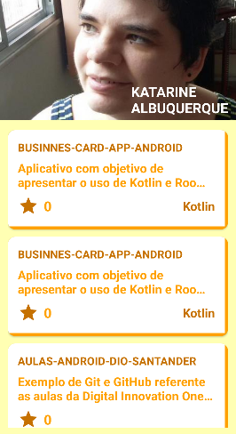

# Meu Portifólio GitHub
### App Android

### I. Sobre

O objetivo do aplicativo é listar os meus repositórios do GitHub através da <a href="https://docs.github.com/pt/rest/guides/getting-started-with-the-rest-api">Api Rest</a> do GitHub.

O aplicativo utiliza metodologias fornecidas e eficazes da tecnologia para obter uma melhor performace e oferecer uma organização no desenvolvimento.

### II. Layout do Projeto

### III. Tecnologias Utilizadas

* <a href="https://developer.android.com/studio?hl=pt">Android Studio</a>
* <a href="https://developer.android.com/topic/architecture">MVVM</a>
* <a href="https://developer.android.com/topic/libraries/architecture/livedata?hl=pt-br">LiveData</a>
* <a href="https://developer.android.com/topic/libraries/architecture/viewmodel?hl=pt-br">ViewModel</a>
* <a href="https://docs.github.com/pt/rest/guides/getting-started-with-the-rest-api">Api Rest</a>
* <a href="https://square.github.io/retrofit/">Retrofit 2</a>
* <a href="https://square.github.io/retrofit/">Retrofit 2 Converter Gson</a>
* <a href="https://square.github.io/picasso/">Picasso</a>

### IV. Plugins

* kotlin-kapt
* kotlin-android-extensions

### V. Implementações

* implementation "androidx.fragment:fragment-ktx:1.4.1"
* implementation "androidx.lifecycle:lifecycle-runtime-ktx:2.5.0-rc01"
* annotationProcessor "androidx.lifecycle:lifecycle-compiler:2.5.0-rc01"
* implementation "com.squareup.picasso:picasso:2.8"
* implementation "com.squareup.retrofit2:retrofit:2.9.0"
* implementation "com.squareup.retrofit2:converter-gson:2.9.0"

### VI. Autor

#### Katarine Albuquerque
##### _Linkedin_: <a href="https://www.linkedin.com/in/katarine-albuquerque/">/katarine-albuquerque</a>
##### _GitHub_: <a href="https://github.com/KatarineAlbuquerque">/KatarineAlbuquerque</a>